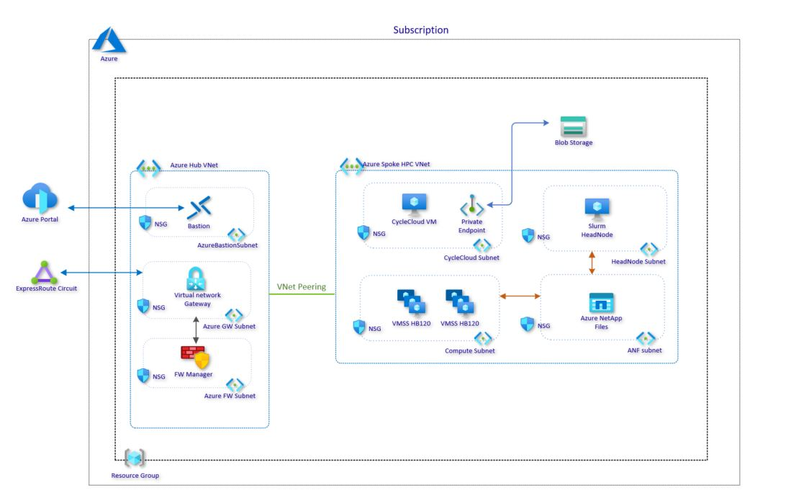

# Running WRF with CycleCloud
Objective of this repository is to deploy a HPC cluster with Azure CycleCloud and run WRF.

* Architecture



## Pre-requisites

* Azure Subcription
* Quota allocated for the specialized HPC vm HB120v3 
* Azure NetApp Files / Azure Files (NFS) / NFS on Azure Blob / Parallel Filesystem (Lustre/GPFS/BeeGFS...)
* Service Principal contributor role or Managed Identity permissions
* TBD

## CycleCloud

TBD

### 1. CycleCloud Installation

TBD 
#### 1.1 CycleCloud Configuration

TBD

### 2. HPC Cluster


**cloud-init section**

The following cloud-init section has to be present for all the partitions defined in CycleCloud. In this case HPC partition.
```
#!bin/bash
sudo yum -y install epel-release
sudo yum -y install htop
sudo yum -y groupinstall "Development Tools"
sudo yum -y install python-pathlib
sudo yum -y install screen
sudo yum -y install clang
sudo yum -y install python3
sudo yum -y install tcsh


if [[ -e /dev/nvme0n1 ]]; then
  # Setup RAID0 on HBv3 NVMe disks:
  mdadm --create --verbose /dev/md0 --level=stripe --raid-devices=2 /dev/nvme0n1 /dev/nvme1n1
  mkfs.ext4 /dev/md0
  mkdir -p /mnt/nvme
  mount /dev/md0 /mnt/nvme
  mkdir /mnt/nvme/scratch
  chmod 777 -R /mnt/nvme
fi

setenforce 0
# Disable SELinux
cat  << EOF > /etc/selinux/config
SELINUX=disabled
EOF
```

### 3. Spack Installation and Configuration

We will not use the default Spack installation, instead we will use the installation procedure described in [AzureHPC](https://github.com/Azure/azurehpc.git) 

From the Slurm Head node we will create the `/shared/apps` direcotry and will clone the AzureHPC reposiory. 
```
sudo mkdir /shared/apps/
sudo chown azureuser:azureuser /shared/apps/
cd /shared/apps
sudo yum install git -y 
git clone https://github.com/Azure/azurehpc.git
```

Now we have to make a change before we install Spack:
* Edit the file `/shared/apps/azurehpc/apps/spack/build_spack.sh` and change the `SHARED_APP` variable to point to to /shared/app. So `SHARED_APP=/shared/apps`

Install Spack with the following command:
```
cd /shared/apps/azurehpc/apps/spack
./build_spack.sh hbv2
```

Finally, make the last change before installing applications:
* Change the build_stage for a fast complilation of the applications. We will use the NVMe drives allocated in the HB120v3 nodes as scratch, so in the file `/shared/apps/spack/0.16.0/spack/etc/spack/defaults/config.yaml` make the following changes:
```
build_stage:
    - /mnt/nvme/scratch   # Note that the directory is created with cloud-init on VM startup.
```
Also change the number of threads for compilation:
```
build_jobs: 16
```

### 4. WRF Installation

We will run WRF on the HB series so we will use one of the HB120v3 as "compilation node" to be consistent with the architecture. So first thing is to sumbit an Interactive job to allocate a node in the cluster to compile WRF and the dependencies needed:

```
screen  # Optional, but is a good practice in case

# With Slurm 
salloc -N1 # This command will take 8-10 minutes until
srun hostname
ssh ip-0A060005   # Replace ip-0A060005 with the output of the srun commnad

# With PBSPro
qsub -I -q workq -l walltime=06:00:00
```
Load spack environment settings:
```
. /shared/apps/spack/0.16.0/spack/share/spack/setup-env.sh
```

Now we can check what options are available for WRF with `spack info wrf` before we start:
```
Package:   wrf

Description:
    The Weather Research and Forecasting (WRF) Model is a next-generation
    mesoscale numerical weather prediction system designed for both
    atmospheric research and operational forecasting applications.

Homepage: https://www.mmm.ucar.edu/weather-research-and-forecasting-model

Maintainers: @MichaelLaufer @ptooley

Tags:
    None

Preferred version:
    4.2        https://github.com/wrf-model/WRF/archive/v4.2.tar.gz

Safe versions:
    4.2        https://github.com/wrf-model/WRF/archive/v4.2.tar.gz
    4.0        https://github.com/wrf-model/WRF/archive/v4.0.tar.gz
    3.9.1.1    https://github.com/wrf-model/WRF/archive/V3.9.1.1.tar.gz

Variants:
    Name [Default]            Allowed values          Description
    ======================    ====================    ========================

    build_type [dmpar]        serial, smpar,
                              dmpar, dm+sm
    compile_type [em_real]    em_real,
                              em_quarter_ss,
                              em_b_wave, em_les,
                              em_heldsuarez,
                              em_tropical_cyclone,
                              em_hill2d_x,
                              em_squall2d_x,
                              em_squall2d_y,
                              em_grav2d_x,
                              em_seabreeze2d_x,
                              em_scm_xy
    nesting [basic]           no_nesting, basic,
                              preset_moves,
                              vortex_following
    pnetcdf [on]              on, off                 Parallel IO support
                                                      through Pnetcdf library

Installation Phases:
    configure    build    install

Build Dependencies:
    hdf5    libpng    libtool  mpi       netcdf-fortran   perl       tcsh  zlib
    jasper  libtirpc  m4       netcdf-c  parallel-netcdf  pkgconfig  time

Link Dependencies:
    hdf5    libpng    mpi       netcdf-fortran   perl
    jasper  libtirpc  netcdf-c  parallel-netcdf  zlib

Run Dependencies:
    None

Virtual Packages:
    None

```

Load gcc 9.2 compilers and OpenMPI before we start with wrf installation:
```
. /shared/apps/spack/0.16.0/spack/share/spack/setup-env.sh
module avail
module load gcc-9.2.0
module load mpi/openmpi
module load amd/aocl


# spack external find (optional)
```

Now install wrf application with the following options:
``` 
alias python='/usr/bin/python3.6'
spack install wrf %gcc@9.2.0 ^openmpi@4.1.0    # Note that could take few hours to install and compile all dependencies.
```
It will give a error in line 292 when building. There is a bug in the WRF version, just replace the lines as indicated below:
```
         # num of compile jobs capped at 20 in wrf
-        num_jobs = str(min(int(make_jobs, 10)))
+        num_jobs = str(min(int(make_jobs), 10))
 
         # Now run the compile script and track the output to check for
         # failure/success We need to do this because upstream use `make -i -k`
```
Ammend in the same file in line 282
```
result_buf = csh( 
     "./compile", 
     "-j", 
     num_jobs, 
     self.spec.variants["compile_type"].value, 
     output=str, 
     error=str 
 ) 
```
Finally run again the command to install spack: 
```
spack install wrf %gcc@9.2.0 ^openmpi@4.1.0
```

Now WRF should be available in the modules/spack:
```
[azureuser@ip-0A060007 wrf]$ spack find wrf
==> 1 installed package
-- linux-centos7-zen2 / gcc@9.2.0 -------------------------------
wrf@4.2

$ spack load wrf@4.2

# Locate and go to WRF installation directory
$ spack cd -i wrf@4.2
$ pwd
$ ls -l ./main/wrf.exe
-rwxr-xr-x. 1 azureuser azureuser 46545352 Jul  8 16:50 ./main/wrf.exe
```

#### Benchmarks
The Conus 2.5Km test is available from www2.mmm.ucar.edu 
```
wget https://www2.mmm.ucar.edu/wrf/src/conus2.5km.tar.gz
```


### WRF 3.9.1 ####

```
$ screen 
$ qsub -I -q workq -l walltime=05:00:00

$ sudo yum -y install tmux scl file gcc gcc-gfortran gcc-c++ glibc.i686 libgcc.i686 libpng-devel jasper \
  jasper-devel hostname m4 make perl tar bash time wget which zlib zlib-devel \
  openssh-clients openssh-server net-tools fontconfig libgfortran libXext libXrender \
  ImageMagick sudo epel-release git help2man
  
  
# COMPILERS TESTS 

$ mkdir -p $HOME/wrfpoc/zen3/Build_WRF
$ mkdir -p $HOME/wrfpoc/zen3/TESTS

$ which gfortran
/user/bin/gfortran
$ which cpp
/user/bin/cpp
$ which gcc
/user/bin/gcc

$ gcc --version
gcc (Ubuntu 5.3.1−14ubuntu2.1) 5.3.1 20160413
Copyright (C) 2015 Free Software Foundation, Inc.
This is free software; see the source for copying conditions. There is NO
warranty; not even for MERCHANTABILITY of FITNESS FOR A PARTICULAR PURPOSE.

$ cd $HOME/wrfpoc/zen3/TESTS
$ wget http://www2.mmm.ucar.edu/wrf/OnLineTutorial/compile_tutorial/tar_files/Fortran_C_tests.tar
$ tar -xvf Fortran_C_tests.tar

# Test 1
$ gfortran TEST_1_fortran_only_fixed.f
$ ./a.out
SUCCESS test 1 fortran only fixed format

# Test 2
$ gfortran TEST_2_fortran_only_free.f90
$ ./a.out
Assume Fortran 2003: has FLUSH, ALLOCATABLE, derived type, and ISO C Binding
SUCCESS test 2 fortran only free format

# Test 3
$ gcc TEST_3_c_only.c
$ ./a.out
SUCCESS test 3 c only

# Test 4
$ gcc -c -m64 TEST_4_fortran+c_c.c
$ gfortran -c -m64 TEST_4_fortran+c_f.f90
$ gfortran -m64 TEST_4_fortran+c_f.o TEST_4_fortran+c_c.o
$ ./a.out
C function called by Fortran 
Values are xx = 2.00 and ii = 1
SUCCESS test 4 fortran calling c

# Test 5
$ csh ./TEST_csh.csh
SUCCESS csh test

# Test 6
$ ./TEST_perl.pl
SUCCESS perl test

# Test 7
$ ./TEST_sh.sh
SUCCESS sh test


# BUILDING LIBRARIES
$ cd $HOME/wrfpoc/zen3/Build_WRF
$ mkdir LIBRARIES

$ cd $HOME/wrfpoc/zen3/Build_WRF/LIBRARIES
wget http://www2.mmm.ucar.edu/wrf/OnLineTutorial/compile_tutorial/tar_files/netcdf-4.1.3.tar.gz 
wget http://www2.mmm.ucar.edu/wrf/OnLineTutorial/compile_tutorial/tar_files/jasper-1.900.1.tar.gz 
wget http://prdownloads.sourceforge.net/libpng/libpng-1.6.37.tar.gz?download
wget http://www2.mmm.ucar.edu/wrf/OnLineTutorial/compile_tutorial/tar_files/zlib-1.2.7.tar.gz
wget https://github.com/westes/flex/archive/refs/tags/v2.6.4.tar.gz
wget https://support.hdfgroup.org/ftp/HDF/releases/HDF4.2.13/src/hdf-4.2.13.tar.gz
wget https://support.hdfgroup.org/ftp/HDF5/releases/hdf5-1.10/hdf5-1.10.4/src/hdf5-1.10.4.tar.gz
wget https://www.ijg.org/files/jpegsrc.v9d.tar.gz
mv libpng-1.6.37.tar.gz\?download libpng-1.6.37.tar.gz

```
Create a setevn.sh file:
```
$ vi ~/setenv.sh

#!/bin/bash

ulimit -s unlimited

export OPENSSL=openssl
export YACC="yacc -d"
export J="-j 6"

export DIR=$HOME/wrfpoc/zen3/Build_WRF/LIBRARIES

# COMPILERS
export CC=gcc
export FC=gfortran
export SERIAL_FC=gfortran
export SERIAL_F77=gfortran
export SERIAL_CC=gcc
export SERIAL_CXX=g++
export MPI_FC=mpif90
export MPI_F77=mpif77
export MPI_CC=mpicc
export MPI_CXX=mpicxx

export PATH=$DIR/openmpi/bin:$PATH
export PATH=$DIR/netcdf/bin:$PATH
export NETCDF=$DIR/netcdf
export JASPERLIB=$DIR/grib2/lib
export JASPERINC=$DIR/grib2/include
export FLEX=$DIR/flex/bin/flex
export FLEX_LIB_DIR=$DIR/flex/lib
export HDF4=$DIR/hdf4
export HDF5=$DIR/hdf5
export OPENMPI=$DIR/openmpi
export LIBPNG=$DIR/libpng
export LIBPNGLIB=$DIR/libpng
# export NCARG=$DIR/ncl --> done via anaconda

# run-time linking   ${H5DIR}/lib
export LD_LIBRARY_PATH=${HDF5}/lib:$LD_LIBRARY_PATH
export LD_LIBRARY_PATH=${HDF4}/lib:$LD_LIBRARY_PATH
export LD_LIBRARY_PATH=${NETCDF}/lib:$LD_LIBRARY_PATH
export LD_LIBRARY_PATH=${JASPERLIB}:$LD_LIBRARY_PATH
export LD_LIBRARY_PATH=${FLEX_LIB_DIR}:$LD_LIBRARY_PATH
export LD_LIBRARY_PATH=${FLEX_LIB_DIR}:$LD_LIBRARY_PATH
export LD_LIBRARY_PATH=${OPENMPI}/lib:$LD_LIBRARY_PATH
export LD_LIBRARY_PATH=${LIBPNG}/lib:$LD_LIBRARY_PATH
export LD_LIBRARY_PATH=/usr/lib64:$LD_LIBRARY_PATH

# WRF
export WRFV3=$HOME/wrfpoc/zen3/Build_WRF/WRFV3
export WRFIO_NCD_LARGE_FILE_SUPPORT=1
export WRF_CHEM=1
export WRF_KPP=1

```

We will compile now the libraries needed.

```
$ source ~/setenv.sh
$ module avail
$ module load gcc-9.2.0
$ module load mpi/openmpi


# zlib
cd $HOME/wrfpoc/zen3/Build_WRF/LIBRARIES
tar -zxvf zlib-1.2.7.tar.gz
cd $HOME/wrfpoc/zen3/Build_WRF/LIBRARIES/zlib-1.2.7
./configure --prefix=$DIR/zlib
make
make install
cd ..


# jpeg-9b
cd $HOME/wrfpoc/zen3/Build_WRF/LIBRARIES
tar zxvf jpegsrc.v9d.tar.gz
cd $HOME/wrfpoc/zen3/Build_WRF/LIBRARIES/jpeg-9d
./configure --prefix=$DIR/jpeg --disable-dependency-tracking
make
make install
cd ..


# netcdf
cd $HOME/wrfpoc/zen3/Build_WRF/LIBRARIES
tar zxvf netcdf-4.1.3.tar.gz
cd $HOME/wrfpoc/zen3/Build_WRF/LIBRARIES/netcdf-4.1.3
export LDFLAGS="-L$DIR/zlib/lib -L$DIR/jpeg/lib"
export CPFLAGS="-I$DIR/zlib/include -I$DIR/jpeg/include"
./configure --prefix=$DIR/netcdf --disable-dap --disable-netcdf-4 --disable-shared  # Check if this should be with shared libraries
make
make install


# hdf4 (Build netcdf first!!! and enable shared-libraries - Is Needed by OBSGRID later)
cd $HOME/wrfpoc/zen3/Build_WRF/LIBRARIES
tar zxvf hdf-4.2.13.tar.gz
cd $HOME/wrfpoc/zen3/Build_WRF/LIBRARIES/hdf-4.2.13
# ./configure --prefix=$DIR/hdf4 --with-zlib=$DIR/zlib --enable-fortran --with-jpeg=$DIR/jpeg   # --> Use this with gcc-4.8.5 (DOES NOT WORK WITH OBSGRID)
# ./configure --prefix=$DIR/hdf4 --with-zlib=$DIR/zlib --enable-fortran --with-jpeg=$DIR/jpeg   --with-gnu-ld    # --> Use this with gcc-9.2.0 (DOES NOT WORK WITH OBSGRID)
./configure --prefix=$DIR/hdf4 --with-zlib=$DIR/zlib --disable-fortran --with-jpeg=$DIR/jpeg --enable-shared --with-gnu-ld    # --> Use this with gcc-9.2.0 (THIS ONE WORKS!)
make 
make install
cd ..

# hdf5
cd $HOME/wrfpoc/zen3/Build_WRF/LIBRARIES
tar zxvf hdf5-1.10.4.tar.gz
cd $HOME/wrfpoc/zen3/Build_WRF/LIBRARIES/hdf5-1.10.4 
./configure --prefix=$DIR/hdf5 --enable-hl --enable-fortran --enable-unsupported --enable-cxx  --with-zlib=$DIR/zlib --with-pic
make 
make install
cd ..

# libpng
cd $HOME/wrfpoc/zen3/Build_WRF/LIBRARIES
tar -zxvf libpng-1.6.37.tar.gz
cd $HOME/wrfpoc/zen3/Build_WRF/LIBRARIES/libpng-1.6.37
export LDFLAGS=-L$DIR/zlib/lib
export CPFLAGS=-I$DIR/zlib/include
./configure --prefix=$DIR/libpng
make
make install
cd ..


#JasPer
cd $HOME/wrfpoc/zen3/Build_WRF/LIBRARIES
tar -zxvf jasper-1.900.1.tar.gz
cd $HOME/wrfpoc/zen3/Build_WRF/LIBRARIES/jasper-1.900.1
./configure --prefix=$DIR/jasper
make
make install
cd ..


#Flex
sudo yum install -y help2man
cd $HOME/wrfpoc/zen3/Build_WRF/LIBRARIES
tar -zxvf v2.6.4.tar.gz
cd $HOME/wrfpoc/zen3/Build_WRF/LIBRARIES/flex-2.6.4
./autogen.sh
./configure --prefix=$DIR/flex
make
make install
cd ..


# Libraries compatibility tests
$ cd $HOME/wrfpoc/zen3/TESTS
$ wget http://www2.mmm.ucar.edu/wrf/OnLineTutorial/compile_tutorial/tar_files/Fortran_C_NETCDF_MPI_tests.tar
$ tar -xvf Fortran_C_NETCDF_MPI_tests.tar

# Test 1: Fortran + C + NetCDF
$ cp ${NETCDF}/include/netcdf.inc .
$ gfortran -c 01_fortran+c+netcdf_f.f
$ gcc -c 01_fortran+c+netcdf_c.c
$ gfortran 01_fortran+c+netcdf_f.o 01_fortran+c+netcdf_c.o -L${NETCDF}/lib -lnetcdff -lnetcdf
$ ./a.out
C function called by Fortran
Values are xx = 2.00 and ii = 1
SUCCESS test 1 fortran + c + netcdf


# Test 2: Fortran + C + NetCDF + MPI
$ cp ${NETCDF}/include/netcdf.inc .
$ mpif90 -c 02_fortran+c+netcdf+mpi_f.f
$ mpicc -c 02_fortran+c+netcdf+mpi_c.c
$ mpif90 02_fortran+c+netcdf+mpi_f.o 02_fortran+c+netcdf+mpi_c.o -L${NETCDF}/lib -lnetcdff -lnetcdf
$ mpirun -np 2 ./a.out
   C function called by Fortran
   Values are xx =  2.00 and ii = 1
   C function called by Fortran
   Values are xx =  2.00 and ii = 1
 status =            2
 status =            2
 SUCCESS test 2 fortran + c + netcdf + mpi
 SUCCESS test 2 fortran + c + netcdf + mpi
 
# BUILDING WRF_V3.9.1  
# Upload Model PAckage.zip to the server and uncompres. Then copy file WRFV3.9.1.tar.gz
$ cd $HOME/wrfpoc/zen3/Build_WRF
$ cp {your_location}/WRFV3.9.1.tar.gz 
$ tar zxvf WRFV3.9.1.tar.gz
$ cd $HOME/wrfpoc/zen3/Build_WRF/WRFV3
$ ./clean -a
$ ./configure

```
Few options are presented 
```
checking for perl5... no
checking for perl... found /bin/perl (perl)
Will use NETCDF in dir: /shared/home/azureuser/wrfpoc/zen3/Build_WRF/LIBRARIES/netcdf
HDF5 not set in environment. Will configure WRF for use without.
PHDF5 not set in environment. Will configure WRF for use without.
Will use 'time' to report timing information


If you REALLY want Grib2 output from WRF, modify the arch/Config_new.pl script.
Right now you are not getting the Jasper lib, from the environment, compiled into WRF.

------------------------------------------------------------------------
Please select from among the following Linux x86_64 options:

  1. (serial)   2. (smpar)   3. (dmpar)   4. (dm+sm)   PGI (pgf90/gcc)
  5. (serial)   6. (smpar)   7. (dmpar)   8. (dm+sm)   PGI (pgf90/pgcc): SGI MPT
  9. (serial)  10. (smpar)  11. (dmpar)  12. (dm+sm)   PGI (pgf90/gcc): PGI accelerator
 13. (serial)  14. (smpar)  15. (dmpar)  16. (dm+sm)   INTEL (ifort/icc)
                                         17. (dm+sm)   INTEL (ifort/icc): Xeon Phi (MIC architecture)
 18. (serial)  19. (smpar)  20. (dmpar)  21. (dm+sm)   INTEL (ifort/icc): Xeon (SNB with AVX mods)
 22. (serial)  23. (smpar)  24. (dmpar)  25. (dm+sm)   INTEL (ifort/icc): SGI MPT
 26. (serial)  27. (smpar)  28. (dmpar)  29. (dm+sm)   INTEL (ifort/icc): IBM POE
 30. (serial)               31. (dmpar)                PATHSCALE (pathf90/pathcc)
 32. (serial)  33. (smpar)  34. (dmpar)  35. (dm+sm)   GNU (gfortran/gcc)
 36. (serial)  37. (smpar)  38. (dmpar)  39. (dm+sm)   IBM (xlf90_r/cc_r)
 40. (serial)  41. (smpar)  42. (dmpar)  43. (dm+sm)   PGI (ftn/gcc): Cray XC CLE
 44. (serial)  45. (smpar)  46. (dmpar)  47. (dm+sm)   CRAY CCE (ftn $(NOOMP)/cc): Cray XE and XC
 48. (serial)  49. (smpar)  50. (dmpar)  51. (dm+sm)   INTEL (ftn/icc): Cray XC
 52. (serial)  53. (smpar)  54. (dmpar)  55. (dm+sm)   PGI (pgf90/pgcc)
 56. (serial)  57. (smpar)  58. (dmpar)  59. (dm+sm)   PGI (pgf90/gcc): -f90=pgf90
 60. (serial)  61. (smpar)  62. (dmpar)  63. (dm+sm)   PGI (pgf90/pgcc): -f90=pgf90
 64. (serial)  65. (smpar)  66. (dmpar)  67. (dm+sm)   INTEL (ifort/icc): HSW/BDW
 68. (serial)  69. (smpar)  70. (dmpar)  71. (dm+sm)   INTEL (ifort/icc): KNL MIC
 72. (serial)  73. (smpar)  74. (dmpar)  75. (dm+sm)   FUJITSU (frtpx/fccpx): FX10/FX100 SPARC64 IXfx/Xlfx

```
Select `34` and nesting = `1. Default`

The configuration will create the `configure.wrf` file. Modify the value of DM_CC as indicated below:
```
DM_CC           =       mpicc -DMPI2_SUPPORT
```

Now we need to decide which type of case you wish to compile. Options are listed below.
```
em_real (3d real case)
em_quarter_ss (3d ideal case)
em_b_wave (3d ideal case)
em_les (3d ideal case)
em_heldsuarez (3d ideal case)
em_tropical_cyclone (3d ideal case)
em_hill2d_x (2d ideal case)
em_squall2d_x (2d ideal case)
em_squall2d_y (2d ideal case)
em_grav2d_x (2d ideal case)
em_seabreeze2d_x (2d ideal case)
em_scm_xy (1d ideal case)
```
For this purpose we are going to compile WRF for real cases. Compilation should take about 20-30 minutes. The ongoing compilation can be checked.
```
$ ./compile em_real >& compile.log &
$ tail -f compile.log
```

Once is completed the output should be like this:
```
==========================================================================
build started:   Thu Jul 22 16:58:45 UTC 2021
build completed: Thu Jul 22 17:32:15 UTC 2021

--->                  Executables successfully built                  <---

-rwxrwxr-x. 1 azureuser azureuser 63292080 Jul 22 17:32 main/ndown.exe
-rwxrwxr-x. 1 azureuser azureuser 63148792 Jul 22 17:32 main/real.exe
-rwxrwxr-x. 1 azureuser azureuser 62438144 Jul 22 17:32 main/tc.exe
-rwxrwxr-x. 1 azureuser azureuser 79232976 Jul 22 17:29 main/wrf.exe

==========================================================================

```

### Pre-Processing Tools ####
#### 1. WPS #####

```
$ cd $HOME/wrfpoc/zen3/Build_WRF/WPS
$ ./configure
```
 1.  Linux x86_64, gfortran    (serial)
 2.  Linux x86_64, gfortran    (serial_NO_GRIB2)
 3.  Linux x86_64, gfortran    (dmpar)
 4.  Linux x86_64, gfortran    (dmpar_NO_GRIB2)
 5.  Linux x86_64, PGI compiler   (serial)
 6.  Linux x86_64, PGI compiler   (serial_NO_GRIB2)
...
--> Select Option 3

```
$ vi configure.wps
```
Replace the file `configure.wps` with the following values:

```
DM_FC               = mpif90
DM_CC               = mpicc
CPP                 = cpp -P -traditional
```
Now compile:
```
$ ./compile 
$ find ./ -name "*.exe"
./util/src/rd_intermediate.exe
./util/src/mod_levs.exe
./util/src/int2nc.exe
./util/src/height_ukmo.exe
./util/src/calc_ecmwf_p.exe
./util/src/avg_tsfc.exe
./util/rd_intermediate.exe
./util/mod_levs.exe
./util/int2nc.exe
./util/height_ukmo.exe
./util/g1print.exe
./util/calc_ecmwf_p.exe
./util/avg_tsfc.exe
./ungrib/src/g1print.exe
./ungrib/g1print.exe
```

#### 2. OBSGRID #####

It requires cairo-devel libaries and  [NCL libraries ](https://www.ncl.ucar.edu/Download/build_from_src.shtml)
NCL Libraries requires also JPEG, ZLIB,Cairo, NetCDF, HDF-4 plus some optional external packages. 
```
$ sudo yum install cairo-devel -y


```
DEBUGGING
```
$ source ~/anaconda3/bin/activate
$ conda create -n ncl_stable -c conda-forge ncl
$ conda activate ncl_stable

$ cd $HOME/wrfpoc/zen3/Build_WRF/OBSGRID
$ export FCFLAGS="-w -Wno-argument-mismatch -O2"
$ export FFLAGS="-w -Wno-argument-mismatch -O2"
```
Run the configuration to generate the configure.oa and we will amend the file before compiling. 
```
$ ./configure
```
Edit the configure.oa file and replace the following lines:
```
NETCDF_LIBS     =       -L${NETCDF}/lib -lnetcdf -lnetcdff
NETCDF_INC      =       -I${NETCDF}/include
NCARG_LIBS      =       -L${NCARG_ROOT}/lib -lncarg -lncarg_gks -lncarg_c -lX11 -lm -lcairo -lfreetype

FC              =       gfortran
FFLAGS          =       -ffree-form -O -fconvert=big-endian -frecord-marker=4
F77FLAGS        =       -ffixed-form -O -fconvert=big-endian -frecord-marker=4
FNGFLAGS        =       $(FFLAGS)
LDFLAGS         =
CC              =       gcc
CFLAGS          =
CPP             =       cpp -P -traditional
CPPFLAGS        =
```

Now compile:
```
$ ./compile
```
The exe files should have been generated now.
```
$ ls -l *.exe
lrwxrwxrwx 1 azureuser azureuser 15 Sep  6 15:43 obsgrid.exe -> src/obsgrid.exe
lrwxrwxrwx 1 azureuser azureuser 18 Sep  6 15:43 plot_level.exe -> src/plot_level.exe
lrwxrwxrwx 1 azureuser azureuser 22 Sep  6 15:43 plot_soundings.exe -> src/plot_soundings.exe
```

#### 3. VPRMpreproc_R99 #####

VPRMpreproc_R99.tar
MRT_32bit_i386_static_patched.tar
ldope_32bit_i386_static_patched.tar


#### 4. MOZBC #####
```
$ cd $HOME/wrfpoc/zen3/Build_WRF/mozbc
$ export NETCDF_DIR=$NETCDF
$ cp ${NETCDF}/include/netcdf.inc .
```
Edit the Makefile with the right $NETCDF
```
LIBS   = -L${NETCDF}/lib $(AR_FILES)
INCLUDE_MODULES = -I${NETCDF}/include

```

Now compile
```
$ ./make_mozbc
```

 


